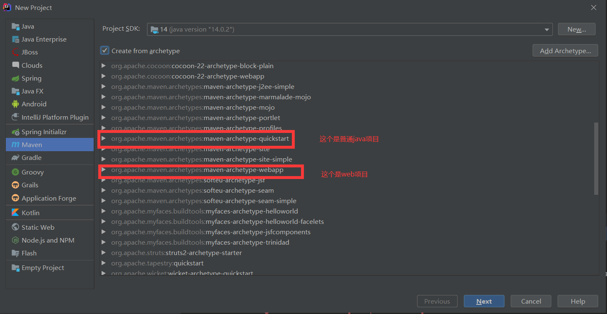

# Maven

# Maven简介

## 简介

Maven 翻译为"专家"、"内行"，是 Apache 下的一个纯 Java 开发的开源项目。基于项目对象模型（缩写：POM）概念，Maven利用一个中央信息片断能管理一个项目的构建、报告和文档等步骤。

Maven 是一个项目管理工具，可以对 Java 项目进行构建、依赖管理。

Maven 也可被用于构建和管理各种项目，例如 C#，Ruby，Scala 和其他语言编写的项目。Maven 曾是 Jakarta 项目的子项目，现为由 Apache 软件基金会主持的独立 Apache 项目。


## 下载

Maven 下载地址：http://maven.apache.org/download.cgi


## 目录结构

| 目录                               | 目的                                                         |
| :--------------------------------- | :----------------------------------------------------------- |
| ${basedir}                         | 存放pom.xml和所有的子目录                                    |
| ${basedir}/src/main/java           | 项目的java源代码                                             |
| ${basedir}/src/main/resources      | 项目的资源，比如说property文件，springmvc.xml                |
| ${basedir}/src/test/java           | 项目的测试类，比如说Junit代码                                |
| ${basedir}/src/test/resources      | 测试用的资源                                                 |
| ${basedir}/src/main/webapp/WEB-INF | web应用文件目录，web项目的信息，比如存放web.xml、本地图片、jsp视图页面 |
| ${basedir}/target                  | 打包输出目录                                                 |
| ${basedir}/target/classes          | 编译输出目录                                                 |
| ${basedir}/target/test-classes     | 测试编译输出目录                                             |
| Test.java                          | Maven只会自动运行符合该命名规则的测试类                      |
| ~/.m2/repository                   | Maven默认的本地仓库目录位置                                  |


### 更换镜像源和仓库储存位置

#### 更换镜像源

```js
<mirror>
    <id>aliyunmaven</id>
    <mirrorOf>*</mirrorOf>
    <name>阿里云公共仓库</name>
    <url>https://maven.aliyun.com/repository/public</url>
</mirror>
```

#### 更换仓库存储位置

​    <localRepository>D:/program file/maven_jar</localRepository>


## Maven命令

**maven 命令的格式为 mvn [plugin-name]:[goal-name]**


#### 常用maven命令


1. 创建maven项目：mvn archetype:create 

   指定 group： -DgroupId=packageName 

   指定 artifact：-DartifactId=projectName

   创建web项目：-DarchetypeArtifactId=maven-archetype-webapp  

2. 创建maven项目：mvn archetype:generate

3. 验证项目是否正确：mvn validate

4. maven 打包：mvn package

5. 只打jar包：mvn jar:jar

6. 生成源码jar包：mvn source:jar

7. 产生应用需要的任何额外的源代码：mvn generate-sources

8. 编译源代码： mvn compile

9. 编译测试代码：mvn test-compile

10. 运行测试：mvn test

11. 运行检查：mvn verify

12. 清理maven项目：mvn clean

13. 生成eclipse项目：mvn eclipse:eclipse

14. 清理eclipse配置：mvn eclipse:clean

15. 生成idea项目：mvn idea:idea

16. 安装项目到本地仓库：mvn install

17. 发布项目到远程仓库：mvn:deploy

18. 在集成测试可以运行的环境中处理和发布包：mvn integration-test

19. 显示maven依赖树：mvn dependency:tree

20. 显示maven依赖列表：mvn dependency:list

21. 下载依赖包的源码：mvn dependency:sources

22. 安装本地jar到本地仓库：mvn install:install-file -DgroupId=packageName -DartifactId=projectName -Dversion=version -Dpackaging=jar -Dfile=path


#### web项目相关命令


1. 启动tomcat：mvn tomcat:run
2. 启动jetty：mvn jetty:run
3. 运行打包部署：mvn tomcat:deploy
4. 撤销部署：mvn tomcat:undeploy
5. 启动web应用：mvn tomcat:start
6. 停止web应用：mvn tomcat:stop
7. 重新部署：mvn tomcat:redeploy
8. 部署展开的war文件：mvn war:exploded tomcat:exploded 


#### 命令参数

-D 指定参数，如 -Dmaven.test.skip=true 跳过单元测试；

-P 指定 Profile 配置，可以用于区分环境；

-e 显示maven运行出错的信息；

-o 离线执行命令,即不去远程仓库更新包；

-X 显示maven允许的debug信息；

-U 强制去远程更新snapshot的插件或依赖，默认每天只更新一次。


## IDEA配置maven


### 创建项目




### 配置pom

```xml
<plugins>
    <!--设置在plugins标签中-->
  <!--jetty插件-->
  <plugin>
    <groupId>org.eclipse.jetty</groupId>
    <artifactId>jetty-maven-plugin</artifactId>
    <version>9.4.5.v20170502</version>
    <configuration>
        <!--热部署，每十秒扫描一次-->
      <scanIntervalSeconds>10</scanIntervalSeconds>
      <webApp>
          <!--可指定当前项目的站点名-->
        <contextPath>/test</contextPath>
      </webApp>
      <httpConnector>
          <!--启动端口-->
        <port>9090</port>
      </httpConnector>
    </configuration>
  </plugin>

    <!--tomcat插件-->
   <plugin>
   <groupId>org.apache.tomcat.maven</groupId>
   <artifactId>tomcat7-maven-plugin</artifactId>
   <version>2.2</version>
   <configuration>
   <!--端口号 -->
   <port>8080</port>
   <!--项目访问的根目录 url:localhost:8090/项目名称/addUser.action -->
   <path>/test</path>
   </configuration>
  </plugin>
    
</plugins>
```


### 启动


## 构建多模块项目

使用maven提供的多模块构建的特性完成maven环境等下多个模块的项目的管理与构建。

这里以四个模块唯一来搭建项目

| 模块             | 内容                                |
| ---------------- | ----------------------------------- |
| maven_parent     | 及模块，也就是常说的parent（pom）   |
| maven_dao        | 数据库的访问层，例如jdbc操作（jar） |
| maven_service    | 项目的业务逻辑层（jar）             |
| maven_controller | 用来接受请求，响应数据（war）       |

### 创建maven_parent项目


### 创建maven_dao模块


### 创建maven_service 模块


### 创建maven_controller 模块


### 修改模块配置

设置jdk版本

单元测试junit版本

删除多于配置

```xml
<properties>
  <project.build.sourceEncoding>UTF-8</project.build.sourceEncoding>
  <maven.compiler.source>1.8</maven.compiler.source>
  <maven.compiler.target>1.8</maven.compiler.target>
</properties>

<dependencies>
  <dependency>
    <groupId>junit</groupId>
    <artifactId>junit</artifactId>
    <version>4.12</version>
    <scope>test</scope>
  </dependency>
</dependencies>

<build>

</build>
```


### 设置模块之间的依赖

#### maven_dao


#### maven_service


#### maven_controller


### 创建servlet


