# SVN介绍

## 简介

Apache Subversion 通常被缩写成 SVN，是一个开放源代码的版本控制系统，Subversion 在 2000 年由 CollabNet Inc 开发，现在发展成为 Apache 软件基金会的一个项目，同样是一个丰富的开发者和用户社区的一部分。

SVN相对于的RCS、CVS，采用了分支管理系统，它的设计目标就是取代CVS。互联网上免费的版本控制服务多基于Subversion。

## SVN 的主要功能

- （1）目录版本控制

  CVS 只能跟踪单个文件的历史, 不过 Subversion 实作了一个 "虚拟" 的版本控管文件系统, 能够依时间跟踪整个目录的变动。 目录和文件都能进行版本控制。

- （2）真实的版本历史

  自从CVS限制了文件的版本记录，CVS并不支持那些可能发生在文件上，但会影响所在目录内容的操作，如同复制和重命名。除此之外，在CVS里你不能用拥有同样名字但是没有继承老版本历史或者根本没有关系的文件替换一个已经纳入系统的文件。在Subversion中，你可以增加（add）、删除（delete）、复制（copy）和重命名（rename），无论是文件还是目录。所有的新加的文件都从一个新的、干净的版本开始。

- （3）自动提交

  一个提交动作，不是全部更新到了档案库中，就是不完全更新。这允许开发人员以逻辑区间建立并提交变动，以防止当部分提交成功时出现的问题。

- （4）纳入版本控管的元数据

  每一个文件与目录都附有一組属性关键字并和属性值相关联。你可以创建, 并儲存任何你想要的Key/Value对。 属性是随着时间来作版本控管的,就像文件內容一样。

- （5）选择不同的网络层

  Subversion 有抽象的档案库存取概念, 可以让人很容易地实作新的网络机制。 Subversion 可以作为一个扩展模块嵌入到Apache HTTP 服务器中。这个为Subversion提供了非常先进的稳定性和协同工作能力，除此之外还提供了许多重要功能: 举例来说, 有身份认证, 授权, 在线压缩, 以及文件库浏览等等。还有一个轻量级的独立Subversion服务器， 使用的是自定义的通信协议, 可以很容易地通过 ssh 以 tunnel 方式使用。

- （6）一致的数据处理方式

  Subversion 使用二进制差异算法来异表示文件的差异, 它对文字(人类可理解的)与二进制文件(人类无法理解的) 两类的文件都一视同仁。 这两类的文件都同样地以压缩形式储存在档案库中, 而且文件差异是以两个方向在网络上传输的。

- （7）有效的分支(branch)与标签(tag)

  在分支与标签上的消耗并不必一定要与项目大小成正比。 Subversion 建立分支与标签的方法, 就只是复制该项目, 使用的方法就类似于硬连接（hard-link）。 所以这些操作只会花费很小, 而且是固定的时间。

- （8）Hackability

  Subversion没有任何的历史包袱; 它主要是一群共用的 C 程序库, 具有定义完善的API。这使得 Subversion 便于维护, 并且可被其它应用程序与程序语言使用。

## SVN 生命周期

### 创建版本库

版本库相当于一个集中的空间，用于存放开发者所有的工作成果。版本库不仅能存放文件，还包括了每次修改的历史，即每个文件的变动历史。

Create 操作是用来创建一个新的版本库。大多数情况下这个操作只会执行一次。当你创建一个新的版本库的时候，你的版本控制系统会让你提供一些信息来标识版本库，例如创建的位置和版本库的名字。

------

### 检出

Checkout 操作是用来从版本库创建一个工作副本。工作副本是开发者私人的工作空间，可以进行内容的修改，然后提交到版本库中。

------

### 更新

顾名思义，update 操作是用来更新版本库的。这个操作将工作副本与版本库进行同步。由于版本库是由整个团队共用的，当其他人提交了他们的改动之后，你的工作副本就会过期。

让我们假设 Tom 和 Jerry 是一个项目的两个开发者。他们同时从版本库中检出了最新的版本并开始工作。此时，工作副本是与版本库完全同步的。然后，Jerry 很高效的完成了他的工作并提交了更改到版本库中。

此时 Tom 的工作副本就过期了。更新操作将会从版本库中拉取 Jerry 的最新改动并将 Tom 的工作副本进行更新。

------

### 执行变更

当检出之后，你就可以做很多操作来执行变更。编辑是最常用的操作。你可以编辑已存在的文件，例如进行文件的添加/删除操作。

你可以添加文件/目录。但是这些添加的文件目录不会立刻成为版本库的一部分，而是被添加进待变更列表中，直到执行了 commit 操作后才会成为版本库的一部分。

同样地你可以删除文件/目录。删除操作立刻将文件从工作副本中删除掉，但该文件的实际删除只是被添加到了待变更列表中，直到执行了 commit 操作后才会真正删除。

Rename 操作可以更改文件/目录的名字。"移动"操作用来将文件/目录从一处移动到版本库中的另一处。

------

### 复查变化

当你检出工作副本或者更新工作副本后，你的工作副本就跟版本库完全同步了。但是当你对工作副本进行一些修改之后，你的工作副本会比版本库要新。在 commit 操作之前复查下你的修改是一个很好的习惯。

Status 操作列出了工作副本中所进行的变动。正如我们之前提到的，你对工作副本的任何改动都会成为待变更列表的一部分。Status 操作就是用来查看这个待变更列表。

Status 操作只是提供了一个变动列表，但并不提供变动的详细信息。你可以用 diff 操作来查看这些变动的详细信息。

------

### 修复错误

我们来假设你对工作副本做了许多修改，但是现在你不想要这些修改了，这时候 revert 操作将会帮助你。

Revert 操作重置了对工作副本的修改。它可以重置一个或多个文件/目录。当然它也可以重置整个工作副本。在这种情况下，revert 操作将会销毁待变更列表并将工作副本恢复到原始状态。

------

### 解决冲突

合并的时候可能会发生冲突。Merge 操作会自动处理可以安全合并的东西。其它的会被当做冲突。例如，"hello.c" 文件在一个分支上被修改，在另一个分支上被删除了。这种情况就需要人为处理。Resolve 操作就是用来帮助用户找出冲突并告诉版本库如何处理这些冲突。

------

### 提交更改

Commit 操作是用来将更改从工作副本到版本库。这个操作会修改版本库的内容，其它开发者可以通过更新他们的工作副本来查看这些修改。

在提交之前，你必须将文件/目录添加到待变更列表中。列表中记录了将会被提交的改动。当提交的时候，我们通常会提供一个注释来说明为什么会进行这些改动。这个注释也会成为版本库历史记录的一部分。Commit 是一个原子操作，也就是说要么完全提交成功，要么失败回滚。用户不会看到成功提交一半的情况。

# 安装配置

服务器：https://www.visualsvn.com/downloads/

客户端：https://tortoisesvn.net/downloads.html

### 服务端配置

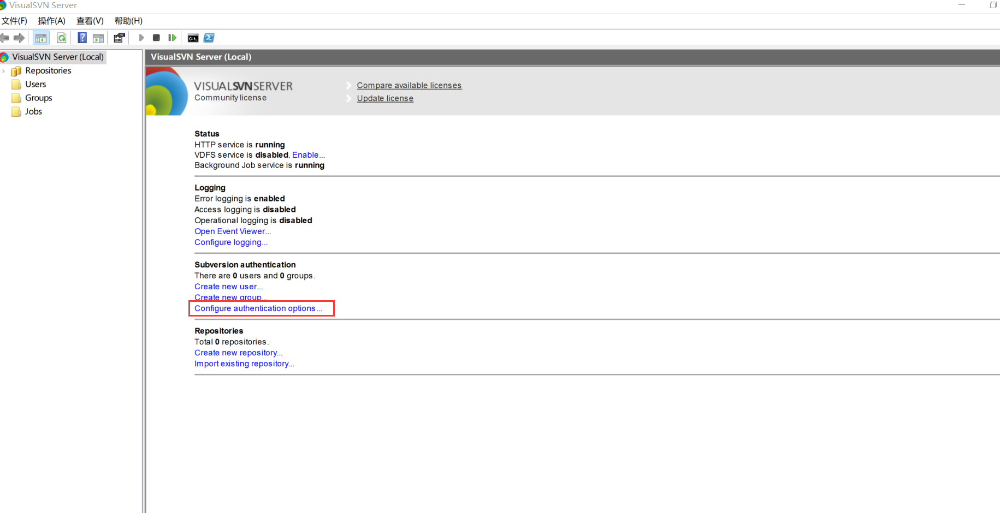

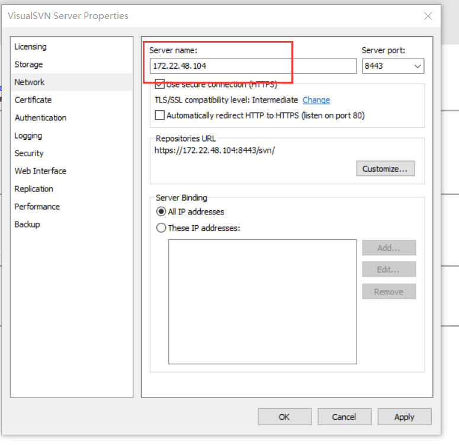

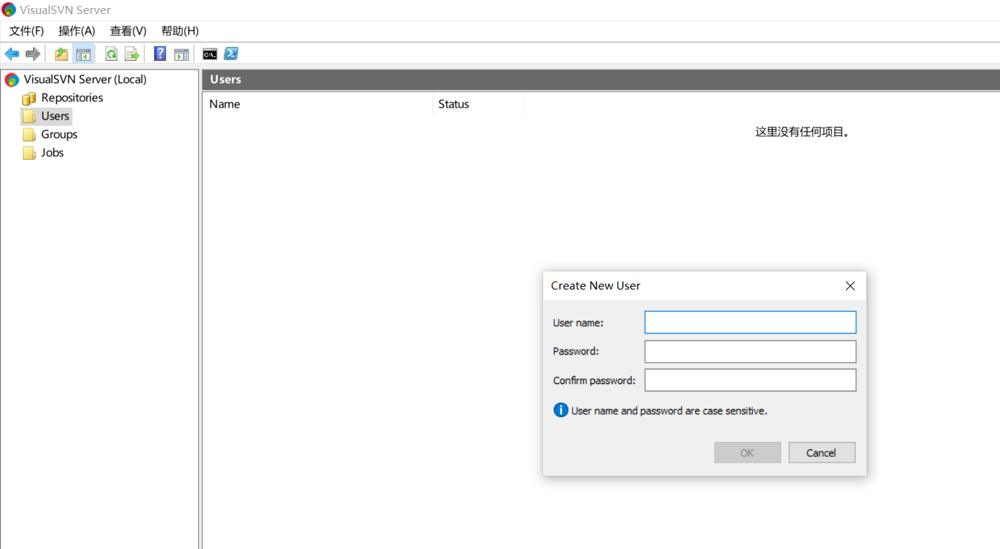

# SVN的使用

## 创建版本库

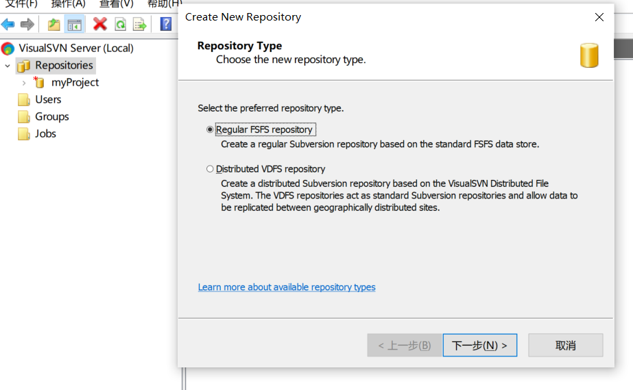

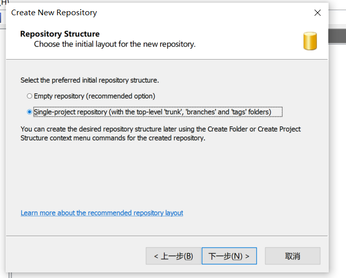

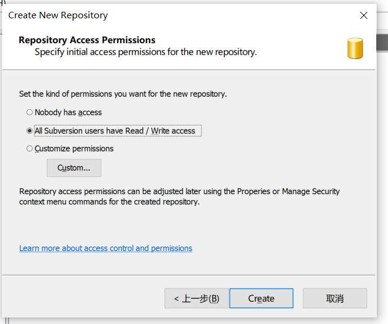

## 签入项目到SVN（import）

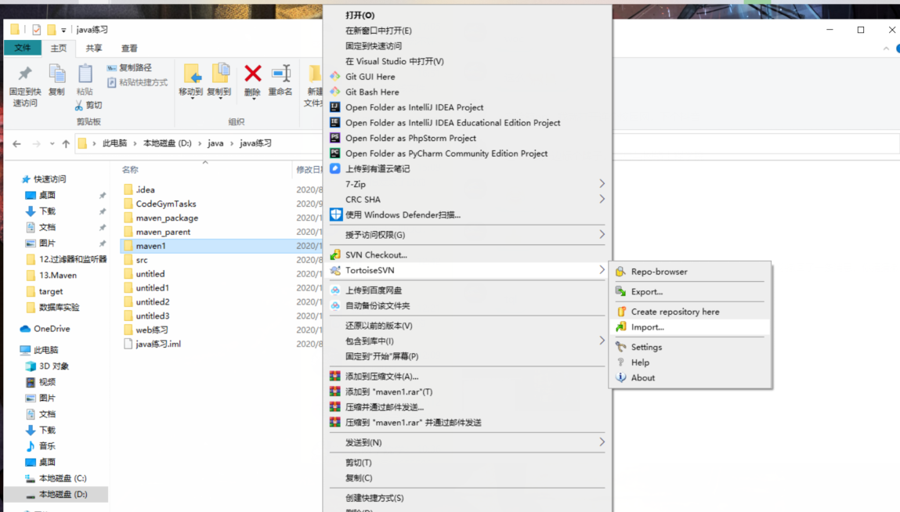

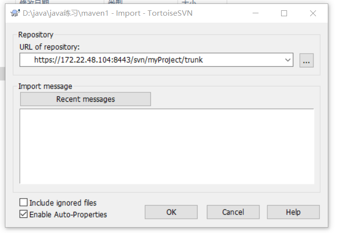

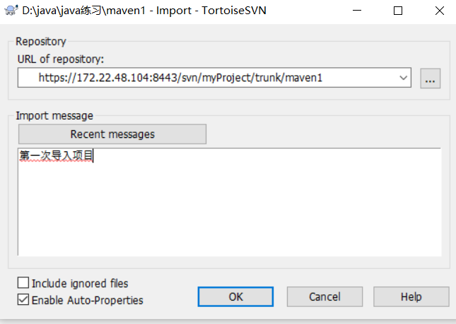

## 检索项目

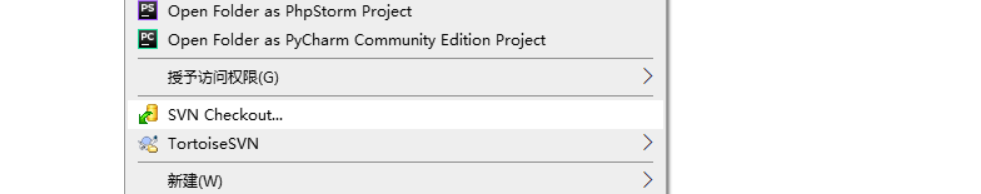

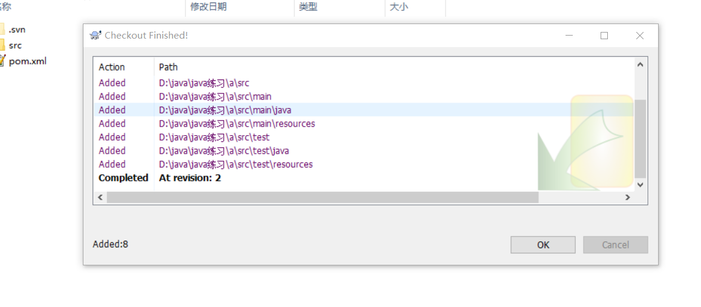

## 提交代码

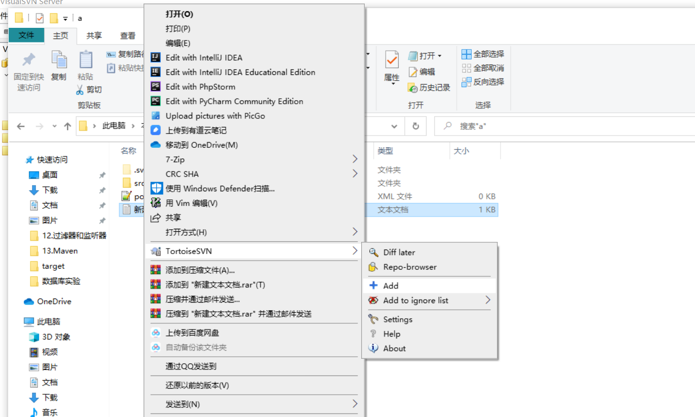

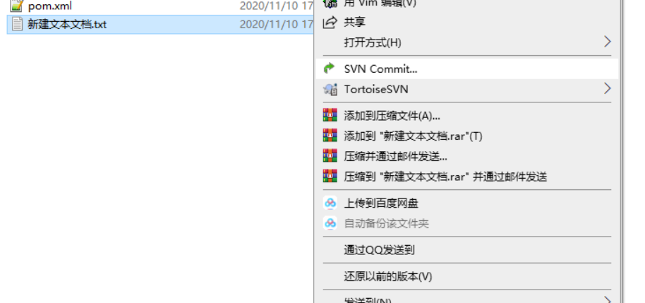

## 更新文件

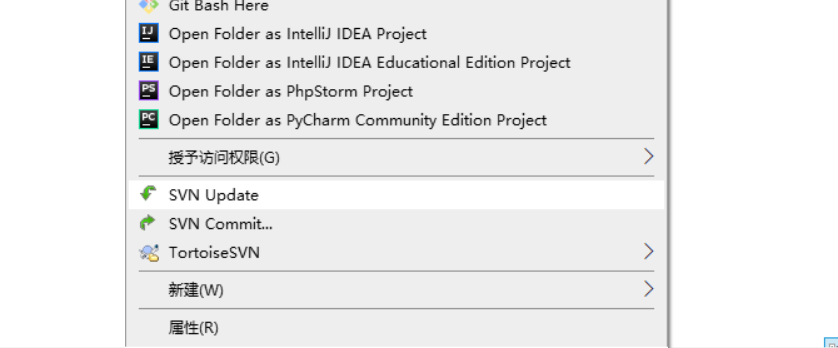

## 版本冲突问题

### 版本冲突原因

假设A、B两个用户都在版本号为100的时候，更新了kingtuns.txt这个文件，A用户在修改完成之后提交kingtuns.txt到服务器，这个时候提交成功，这个时候kingtuns.txt文件的版本号已经变成101了。同时B用户在版本号为100的kingtuns.txt文件上作修改，修改完成之后提交到服务器时，由于不是在当前最新的101版本上作的修改，所以导致提交失败。

 

### 版本冲突现象

冲突发生时，subversion会在当前工作目录中保存所有的目标文件版本[上次更新版本、当前获取的版本(即别人提交的版本)、自己更新的版本、目标文件]。

假设文件名是kingtuns.txt

对应的文件名分别是：

kingtuns.txt.r101

kingtuns.txt.r102

kingtuns.txt.mine

kingtuns.txt。同时在目标文件中标记来自不同用户的更改。

### 解决冲突有三种选择

 

A、放弃自己的更新，使用svn revert（回滚），然后提交。在这种方式下不需要使用svn resolved（解决）

 

B、放弃自己的更新，使用别人的更新。使用最新获取的版本覆盖目标文件，执行resolved filename并提交(选择文件—右键—解决)。

 

C、手动解决：冲突发生时，通过和其他用户沟通之后，手动更新目标文件。然后执行resolved filename来解除冲突，最后提交。

# idea集成使用SVN

## 配置环境

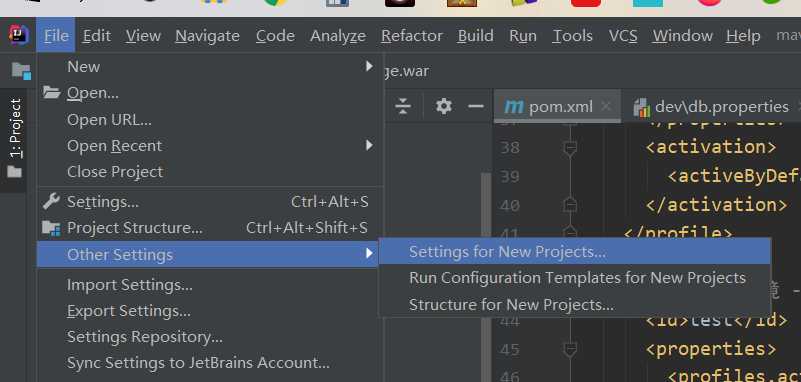

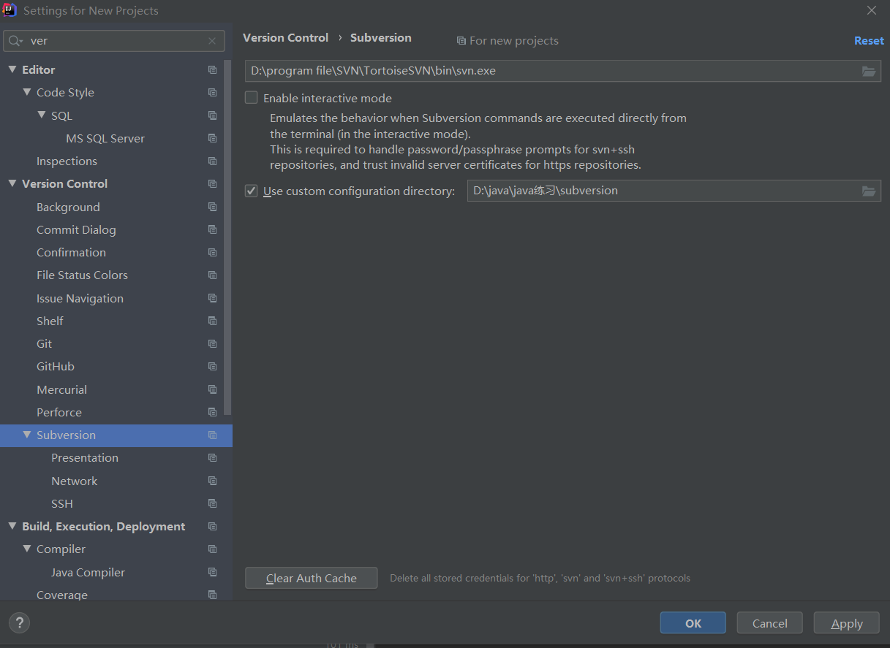

## 检索项目

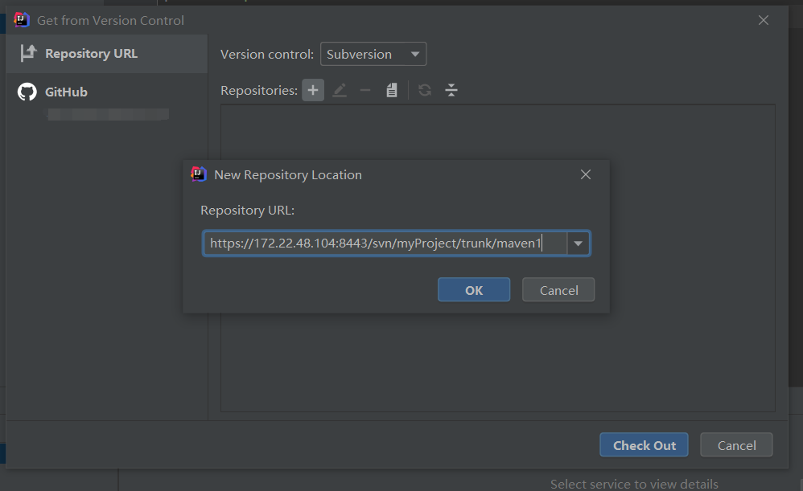

