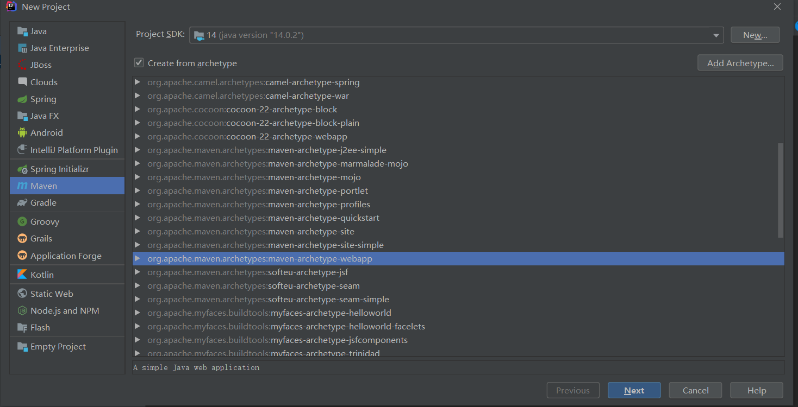
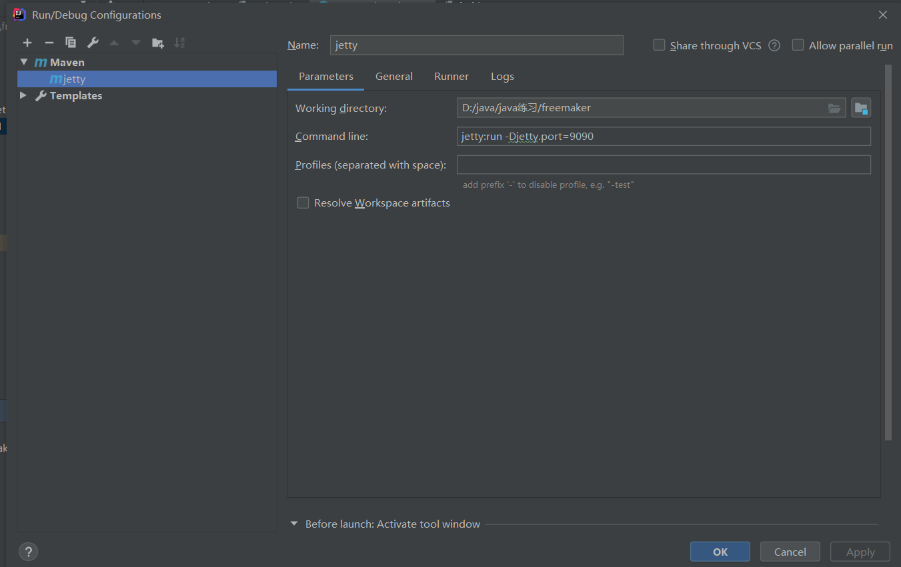

# FreeMarker

## 概述

FreeMarker 是一款 *模板引擎*： 即一种基于模板和要改变的数据， 并用来生成输出文本(HTML网页，电子邮件，配置文件，源代码等)的通用工具。 它不是面向最终用户的，而是一个Java类库，是一款程序员可以嵌入他们所开发产品的组件。

模板编写为FreeMarker Template Language (FTL)。它是简单的，专用的语言， *不是* 像PHP那样成熟的编程语言。 那就意味着要准备数据在真实编程语言中来显示，比如数据库查询和业务运算， 之后模板显示已经准备好的数据。在模板中，你可以专注于如何展现数据， 而在模板之外可以专注于要展示什么数据。


这种方式通常被称为 [MVC (模型 视图 控制器) 模式]，对于动态网页来说，是一种特别流行的模式。 它帮助从开发人员(Java 程序员)中分离出网页设计师(HTML设计师)。设计师无需面对模板中的复杂逻辑， 在没有程序员来修改或重新编译代码时，也可以修改页面的样式。


## 特性

### 1、通用目标

能够生成各种文本：HTML、XML、RTF、Java源代码等等

易于嵌入到你的产品中：轻量级；不需要Servlet环境

插件式模板载入器：可以从任何源载入模板，如本地文件、数据库等等

你可以按你所需生成文本：保存到本地文件；作为Email发送；从Web应用程序发送它返回给Web浏览器

### 2、强大的模板语言

所有常用的指令：include、if/elseif/else、循环结构

在模板中创建和改变变量

几乎在任何地方都可以使用复杂表达式来指定值

命名的宏，可以具有位置参数和嵌套内容

名字空间有助于建立和维护可重用的宏库，或者将一个大工程分成模块，而不必担心名字冲突

输出转换块：在嵌套模板片段生成输出时，转换HTML转义、压缩、语法高亮等等；你可以定义自己的转换

### 3、通用数据模型

FreeMarker不是直接反射到Java对象，Java对象通过插件式对象封装，以变量方式在模板中显示

你可以使用抽象（接口）方式表示对象（JavaBean、XML文档、SQL查询结果集等等），告诉模板开发者使用方法，使其不受技术细节的打扰

### 4、为Web准备

在模板语言中内建处理典型Web相关任务（如HTML转义）的结构

能够集成到Model2 Web应用框架中作为JSP的替代

支持JSP标记库

为MVC模式设计：分离可视化设计和应用程序逻辑；分离页面设计员和程序员

### 5、智能的国际化和本地化

字符集智能化（内部使用UNICODE）

数字格式本地化敏感

日期和时间格式本地化敏感

非US字符集可以用作标识（如变量名）

多种不同语言的相同模板

### 6、强大的XML处理能力

<#recurse> 和<#visit>指令（2.3版本）用于递归遍历XML树

在模板中清楚和直觉的访问XML对象模型


# 环境的搭建

### 新建maven web项目



### 配置坐标依赖和部署插件

pom.xml

```xml
<?xml version="1.0" encoding="UTF-8"?>

<project xmlns="http://maven.apache.org/POM/4.0.0" xmlns:xsi="http://www.w3.org/2001/XMLSchema-instance"
  xsi:schemaLocation="http://maven.apache.org/POM/4.0.0 http://maven.apache.org/xsd/maven-4.0.0.xsd">
  <modelVersion>4.0.0</modelVersion>

  <groupId>org.example</groupId>
  <artifactId>freemaker</artifactId>
  <version>1.0-SNAPSHOT</version>
  <packaging>war</packaging>

  <name>freemaker Maven Webapp</name>
  <!-- FIXME change it to the project's website -->
  <url>http://www.example.com</url>

  <properties>
    <project.build.sourceEncoding>UTF-8</project.build.sourceEncoding>
    <maven.compiler.source>1.8</maven.compiler.source>
    <maven.compiler.target>1.8</maven.compiler.target>
  </properties>

  <dependencies>
    <!--freemarker的坐标依赖-->
    <dependency>
      <groupId>org.freemarker</groupId>
      <artifactId>freemarker</artifactId>
      <version>2.3.23</version>
    </dependency>
    <!--servlet-api的坐标依赖-->
    <dependency>
      <groupId>javax.servlet</groupId>
      <artifactId>javax.servlet-api</artifactId>
      <version>3.0.1</version>
    </dependency>

  </dependencies>

  <build>
    <finalName>freemaker</finalName>
    <!--
插件地址：
Tomcat
http://tomcat.apache.org/maven-plugin-2.2/
Jetty
https://www.eclipse.org/jetty/documentation/current/jetty-mavenplugin.html
-->
    <plugins>
      <!-- 配置jetty插件 -->
      <plugin>
        <groupId>org.eclipse.jetty</groupId>
        <artifactId>jetty-maven-plugin</artifactId>
        <version>9.2.1.v20140609</version>
      </plugin>
    </plugins>
  </build>
</project>
```

### 修改配置文件web.xml

web.xml

```xml
<!DOCTYPE web-app PUBLIC
 "-//Sun Microsystems, Inc.//DTD Web Application 2.3//EN"
 "http://java.sun.com/dtd/web-app_2_3.dtd" >

<web-app>
  <display-name>Archetype Created Web Application</display-name>
  
  <!-- FreeMarker 的Servlet配置 -->
  <servlet>
    <servlet-name>freemarker</servlet-name>
    <servlet-class>freemarker.ext.servlet.FreemarkerServlet</servlet-class>
    <init-param>
      <!-- 模板路径 -->
      <param-name>TemplatePath</param-name>
      <!-- 默认在webapp⽬录下查找对应的模板⽂件 -->
      <param-value>/</param-value>
    </init-param>
    <init-param>
      <!-- 模板默认的编码：UTF-8 -->
      <param-name>default_encoding</param-name>
      <param-value>UTF-8</param-value>
    </init-param>
  </servlet>
  <!-- 处理所有以.ftl结尾的⽂件；ftl是freemarker默认的⽂件后缀 -->
  <servlet-mapping>
    <servlet-name>freemarker</servlet-name>
    <url-pattern>*.ftl</url-pattern>
  </servlet-mapping>
  
</web-app>
```

### 编写servlet类

```java
@WebServlet("/f1")
public class FreeMarker1 extends HttpServlet {
    @Override
    protected void service(HttpServletRequest req, HttpServletResponse resp) throws ServletException, IOException {
        //设置数据 （给模板设置数据）
        req.setAttribute("msg","Hello");
        //请求转发跳转到指定的模板页面    template/f1.ft1
        req.getRequestDispatcher("template/f1.ftl").forward(req, resp);
    }
}
```

### 新建模板文件 ftl

```java
<#--获取数据-->
${msg}
```

### 启动项目



### 访问项目

http://localhost:9090/f1


# FreeMarker数据类型

 freemarker 模板中的数据类型由如下几种：

布尔型：等价于java中的boolean类型， 不同的是不能直接输出，可以转换成字符串再输出

日期型：等价于java中的Date类型， 不同之处在于不能直接输出，需要转换成字符串再输出

 数值型：等价于java 中的int, float, double 等数值类型，有三种显示形式：数值型(默认) 、货币型、百分比型

字符串型：等价于java 中的字符串，有很多内置函数

sequence 类型：等价于java中的数组，list，set 等集合类型

hash 类型：等价于java 中的Map 类型


## 布尔类型

在servlet中设置布尔类型的数据


获取数据

```F#
<#--
    FreeMarker 数据类型
        布尔类型
            在freemarker页面中不能直接输出，如果要输出，需要转换成字符串
            方式一：?c
            方式二：?string 或   ?string('为true时显示的内容','为false时显示的内容')
        日期类型
            在freemark中日期类型不能直接输出，需要转换成日期型或字符串
            1.年月日   ?date
            2.时分秒   ?time
            3.年月日时分秒    ?datetime
            4.自定义格式     ?string("自定义格式")  y M d H m s

-->
```


------


```F#
<h5>布尔类型</h5>
${flag?c} <br>
${flag?string} <br>
${flag?string('yes','no')}<br>
${flag?string('1','0')} <br>

<h5>日期类型</h5>
${createDate?date} <br>
${createDate?time} <br>
${createDate?datetime} <br>
${createDate?string("yyyy/MM/dd HH:mm:ss")} <br>
```